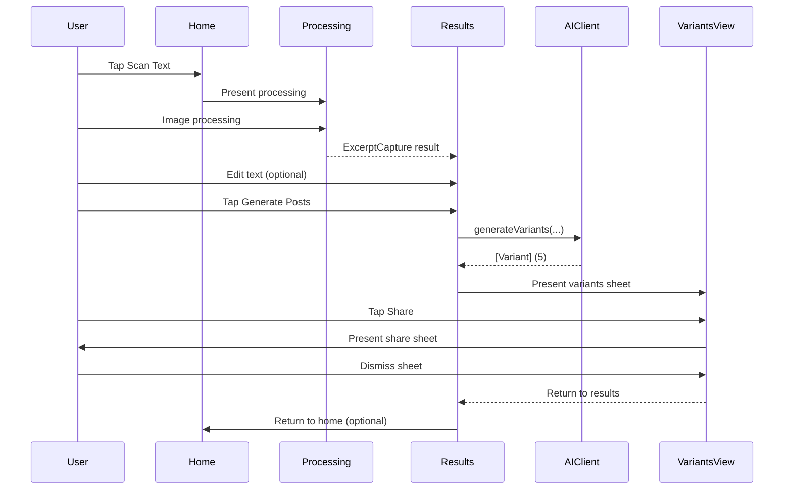

## PostPro v1 — UX/UI Wireframes

### App map (v1, updated)

```mermaid
flowchart TD
  Launch[App Launch] --> Home[Home]
  Home -- Scan Text (Camera) --> Processing[Processing]
  Home -- Choose from Library --> Processing
  Processing --> Results[Results]
  Results -- Generate Posts --> VariantsSheet[Generated Posts (Sheet)]
  VariantsSheet -- Dismiss --> Results
  Results -- Home --> Home
  Results -- Scan New --> Processing
  Home -- History (planned) --> History[HistoryView]
```

Notes:

- Implemented: `Home`, `Processing`, `Results`, `VariantsSheet`.
- Removed: `ComposerView` (functionality integrated inline in `Results`).
- Planned: `HistoryView`, Quick Entry (App Intent + Lock Screen widget).

---

### 1) Home (HomeView, updated)

States: initial (no text).

```text
NAV: (inline)   [ ]

Content
  Hero section with app icon and description
  Feature highlights (Instant Capture, AI Generation, Quick Share)

Bottom Action Bar (pinned to safe area)
  [ camera.viewfinder  Scan Text ]   (Primary, filled, full-width)
  [ photo.on.rectangle  Choose from Library ]  (Secondary, outline, full-width)
```

Key interactions:

- Scan Text → opens Camera directly (system camera); on confirm processes image.
- Choose from Library → opens PHPicker; on choose processes image.

---

### 2) Processing (ProcessingView, updated)

```text
Processing state with smooth loading UI
  [ Animated processing icon with scaling animation ]
  [ "Processing Image" title ]
  [ "Extracting text with OCR..." subtitle ]
  [ Progress indicator ]
```

Flow:

- Automatically processes selected image with `ImageProcessor.process(image:)`
- Shows smooth animations and progress indicators
- Transitions to Results on success or shows error on failure

---

### 3) Results (ContentView with ExtractedTextView, updated)

Sub-states: Editing, Generating, Error.

```text
NAV: Results (inline)   [Home] [Scan New] [Done when editing]

Content
  Editable extracted text (full-height TextEditor with focus management)

Bottom Action Bar (pinned)
  [ sparkles  Generate Posts ]   (Primary, filled, full-width)

Navigation Options
  Home button (returns to start)
  Scan New (preserves current state for comparison)
```

Flow:

- Generate → `AIClient.generateVariants(...)` (mock or real)
- Text editing happens inline with focus management
- Clear navigation paths always available

Notes:

- Variant length label turns red if >900.
- On share complete, basic history log currently uses `UserDefaults` (v1 placeholder).

---

### 4) Generated Posts (VariantsView Sheet, updated)

```text
Bottom sheet (medium → large)
  [title] Generated Posts   [Done]
  Scrollable variants (5 cards):
    [tone badge]   {len}/900
    {text}
    [ Copy ]  [ Share ]
```

Each variant card includes:

- Tone badge with color coding
- Character count display
- Copy button with haptic feedback
- Share button using UIActivityViewController

---

### Primary flows

Capture → Process → Edit → Generate → Share



---

### Design system snapshot (v1 minimal)

- Colors: system colors (Blue for primary CTAs, systemGray6 for cards)
- Typography: system fonts (LargeTitle, Title2, Headline, Subheadline, Body, Caption)
- Shapes: 12–16pt corner radius on cards and buttons; subtle shadow on cards
- Icons: SF Symbols as referenced in screens
- Animations: smooth transitions with .easeInOut timing
- Focus Management: proper keyboard handling and focus states

---

### Screen inventory and statuses

- Home (`HomeView`) — ✅ Implemented
- Processing (`ProcessingView`) — ✅ Implemented
- Results (`ContentView` with `ExtractedTextView`) — ✅ Implemented
- Generated Posts (`VariantsView` sheet) — ✅ Implemented
- History (`HistoryView`, `HistoryStore`) — 🚧 Planned
- Quick Entry (AppIntent + Widget) — 🚧 Planned

---

### Key UX Improvements Implemented

1. **Advanced Navigation**

   - Clear Home button always available
   - "Scan New" preserves previous state for comparison
   - Proper iOS navigation patterns with back buttons

2. **State Management**

   - Smooth transitions between processing states
   - Text editing with focus management
   - State preservation for better user experience

3. **UI Polish**

   - Smooth animations and transitions
   - Proper spacing and iOS-standard design
   - Haptic feedback for better interaction

4. **Development Tools**
   - Mock mode for testing without API calls
   - Comprehensive error handling
   - Realistic mock responses for development
