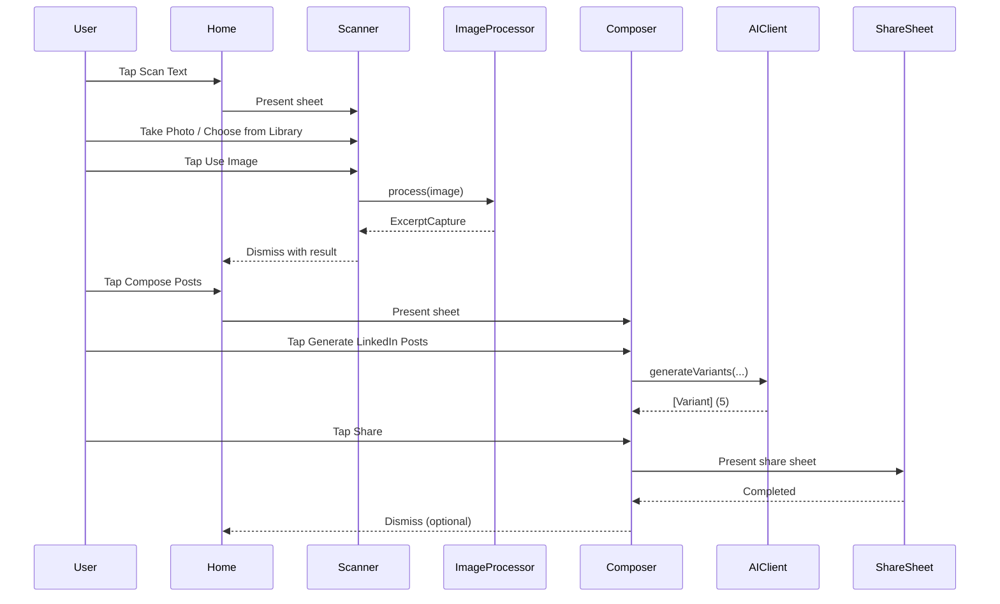

## SnapPost v1 — UX/UI Wireframes

### App map (v1, updated)

```mermaid
flowchart TD
  Launch[App Launch] --> Home[Home]
  Home -- Scan Text (Camera) --> Results[Results]
  Home -- Choose from Library --> Results
  Results -- Generate Posts --> VariantsSheet[Generated Posts (Sheet)]
  VariantsSheet -- Dismiss --> Results
  Results -- Back --> Home
  Home -- History (planned) --> History[HistoryView]
```

Notes:

- Implemented: `Home`, `ImageCaptureView`, `ShareSheet`.
- Removed: `ComposerView` (functionality integrated inline in `Results`).
- Planned: `HistoryView`, Quick Entry (App Intent + Lock Screen widget).

---

### 1) Home (ContentView, updated)

States: initial (no text).

```text
NAV: (inline)   [ ]

Content
  Optional short helper text

Bottom Action Bar (pinned to safe area)
  [ camera.viewfinder  Scan Text ]   (Primary, filled, full-width)
  [ photo.on.rectangle  Choose from Library ]  (Secondary, outline, full-width)
```

Key interactions:

- Scan Text → opens Camera directly (system camera); on confirm returns to Results.
- Choose from Library → opens PHPicker; on choose returns to Results.

---

### 2) Scanner Entry (updated)

Preferred: direct to Camera on “Scan Text”.

Alternative bottom sheet (if source selection needed):

```text
Bottom Sheet (medium)
  [ camera.fill  Take Photo ]   (Primary)
  [ photo.fill   Choose from Library ]   (Secondary)
  [ Cancel ]  (tertiary link)
```

Flow:

- Take Photo → `ImagePicker` (camera)
- Choose from Library → `PhotoPicker` (PHPicker)
- Use Image → runs `ImageProcessor.process(image:)` → on success sets `ExcerptCapture` and dismisses

---

### 3) Results (updated)

Sub-states: Editing, Generating, Error.

```text
NAV: Results (inline)   [Back]

Content
  Editable extracted text (full-height TextEditor)

Bottom Action Bar (pinned)
  [ sparkles  Generate Posts ]   (Primary, filled, full-width)
  [ doc.on.doc  Copy ]           (Secondary, outline, full-width)
  (link) Scan New

Error
  Banner or inline alert with Retry
```

Flow:

- Generate → `AIClient.generateVariants(...)` (mock or real)
- Copy → copies edited text

Notes:

- Variant length label turns red if >900.
- On share complete, basic history log currently uses `UserDefaults` (v1 placeholder).

---

### 4) Generated Posts (Sheet, updated)

```text
Bottom sheet (medium → large)
  [title] Generated Posts   [Done]
  Scrollable variants (5 cards):
    [tone badge]   {len}/900
    {text}
    [ Copy ]  [ Share ]
```

---

### 5) History (planned v1)

```text
NAV: History

Header
  History (last 20)

List
  ┌──────────────────────────────────────────────────────────┐
  │ {postedAt}                                               │
  │ Excerpt: {excerpt...}                                    │
  │ Variant (tone): {text...}                                │
  │ [Copy]  [Share]  [Delete]                                │
  └──────────────────────────────────────────────────────────┘

Empty state
  No history yet
```

Storage:

- `Application Support/SparkPost/history.json` (max 20; evict oldest on insert 21).

---

### 6) Quick Entry (planned v1.1)

```text
Lock Screen Widget → AppIntent → Deep link to Scanner
Siri phrase: "Scan to Draft"
```

---

### Primary flows

Capture → Compose → Share



---

### Design system snapshot (v1 minimal)

- Colors: system colors (Blue for primary CTAs, systemGray6 for cards)
- Typography: system fonts (LargeTitle, Title2, Headline, Subheadline, Body, Caption)
- Shapes: 12–16pt corner radius on cards and buttons; subtle shadow on cards
- Icons: SF Symbols as referenced in screens

---

### Screen inventory and statuses

- Home (`ContentView`) — Implemented
- Scanner (`ImageCaptureView`, `ImagePicker`, `PhotoPicker`) — Implemented
- Composer (`ComposerView`, `ComposeVM`) — Implemented
- Share Sheet (`ShareSheet`) — Implemented
- History (`HistoryView`, `HistoryStore`) — Planned
- Quick Entry (AppIntent + Widget) — Planned
