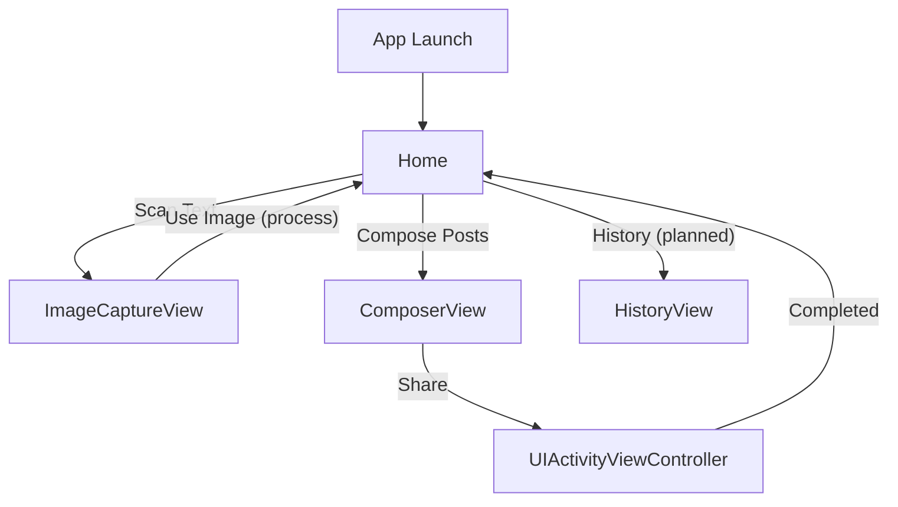
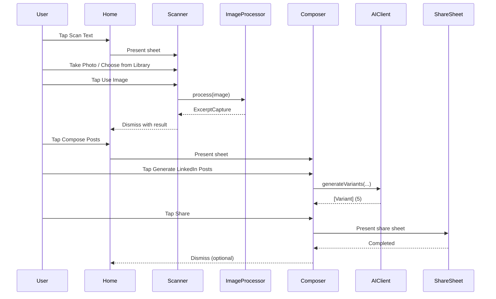

## SnapPost v1 — UX/UI Wireframes

### App map (v1)



Notes:

- Implemented: `Home`, `ImageCaptureView`, `ComposerView`, `ShareSheet`.
- Planned: `HistoryView`, Quick Entry (App Intent + Lock Screen widget).

---

### 1) Home (ContentView)

States: with/without captured text.

```text
NAV: SnapPost (inline)

[ Header ]
  [ doc.text.viewfinder icon ]
  SnapPost
  Transform text into LinkedIn posts

[ Extracted Text Card ]  (shown when excerpt exists)
  Extracted Text
  ┌──────────────────────────────────────────────┐
  │  {excerpt.text} (scroll up to ~200pt)       │
  └──────────────────────────────────────────────┘
  [Copy Text]   [Compose Posts]                Captured {timeAgo}

[ Empty State Card ]  (shown when no excerpt)
  [ doc.text icon ]
  No text captured yet
  Tap the scan button to capture text from an image

[ Primary CTA ]
  [ camera.viewfinder  Scan Text ]

[ Secondary CTA ] (visible when excerpt exists)
  Scan New Text
```

Key interactions:

- Scan Text → presents `ImageCaptureView` (sheet).
- Compose Posts (when excerpt exists) → presents `ComposerView` (sheet).
- Copy Text → copies excerpt to clipboard.

---

### 2) Scanner (ImageCaptureView)

Sub-states: Empty, Preview, Processing, Error.

```text
NAV: (inline)   [Cancel]

Header
  Scan Text
  Capture text from books or documents

Empty
  [ doc.text.viewfinder icon (80pt) ]
  No image selected
  Choose an option below to get started

Preview (after selecting image)
  [ Selected Image (max height ~300, fit, corner 12, shadow) ]
  {if isProcessing}
    [ ProgressView ]
    Processing image...
  {else}
    [ doc.text.viewfinder  Use Image ]

Actions (always visible)
  [ camera.fill  Take Photo ]
  [ photo.fill   Choose from Library ]

Error (alert)
  Title: Error
  Message: {errorMessage}
  Actions: [Retry] [Cancel]
```

Flow:

- Take Photo → `ImagePicker` (camera)
- Choose from Library → `PhotoPicker` (PHPicker)
- Use Image → runs `ImageProcessor.process(image:)` → on success sets `ExcerptCapture` and dismisses

---

### 3) Composer (ComposerView)

Sub-states: Initial, Generating, Variants, Error. Shows mock mode banner in DEBUG/mock.

```text
NAV: Compose Post (inline)   [Cancel]

{if mock mode}
  [ Development Mode ]  Using mock data - no API calls

Excerpt Card
  Extracted Text
  ┌──────────────────────────────────────────────┐
  │ {excerptCapture.text} (scroll up to ~150pt)  │
  └──────────────────────────────────────────────┘
  {N} characters

Book Details (Optional)
  [ Book Title  ....................... ]
  [ Author      ....................... ]

[ sparkles  Generate LinkedIn Posts ]  (disabled while loading)

Generating
  [ ProgressView ]
  Generating LinkedIn posts...
  This may take a few seconds

Variants (5 cards)
  For each variant:
  ┌──────────────────────────────────────────────────────────┐
  │ [tone badge]                         {len}/900           │
  │ {variant.text}                                           │
  │ [ doc.on.doc Copy ]   [ square.and.arrow.up Share ]      │
  └──────────────────────────────────────────────────────────┘

Error
  [ ⚠ ]  Generation Failed
  {error message}
  [ Try Again ]
```

Flow:

- Generate → `AIClient.generateVariants(...)` (mock or real)
- Share → `UIActivityViewController` share sheet
- Copy → copies variant text

Notes:

- Variant length label turns red if >900.
- On share complete, basic history log currently uses `UserDefaults` (v1 placeholder).

---

### 4) Share Sheet (system)

```text
UIActivityViewController
  Activity list (LinkedIn target if installed, Copy, etc.)
  Completion handler → on success, log to history (temporary storage)
```

---

### 5) History (planned v1)

```text
NAV: History

Header
  History (last 20)

List
  ┌──────────────────────────────────────────────────────────┐
  │ {postedAt}                                               │
  │ Excerpt: {excerpt...}                                    │
  │ Variant (tone): {text...}                                │
  │ [Copy]  [Share]  [Delete]                                │
  └──────────────────────────────────────────────────────────┘

Empty state
  No history yet
```

Storage:

- `Application Support/SparkPost/history.json` (max 20; evict oldest on insert 21).

---

### 6) Quick Entry (planned v1.1)

```text
Lock Screen Widget → AppIntent → Deep link to Scanner
Siri phrase: "Scan to Draft"
```

---

### Primary flows

Capture → Compose → Share



---

### Design system snapshot (v1 minimal)

- Colors: system colors (Blue for primary CTAs, systemGray6 for cards)
- Typography: system fonts (LargeTitle, Title2, Headline, Subheadline, Body, Caption)
- Shapes: 12–16pt corner radius on cards and buttons; subtle shadow on cards
- Icons: SF Symbols as referenced in screens

---

### Screen inventory and statuses

- Home (`ContentView`) — Implemented
- Scanner (`ImageCaptureView`, `ImagePicker`, `PhotoPicker`) — Implemented
- Composer (`ComposerView`, `ComposeVM`) — Implemented
- Share Sheet (`ShareSheet`) — Implemented
- History (`HistoryView`, `HistoryStore`) — Planned
- Quick Entry (AppIntent + Widget) — Planned
