## PostPro v1 — UX/UI Wireframes

### App Flow


### 1. Home Screen

```text
Navigation: PostPro

Content Area:
  App Icon + Welcome Message
  Feature Cards:
    - Instant Text Capture
    - AI-Powered Post Generation
    - Quick LinkedIn Sharing

Actions (Bottom):
  [📷 Scan Text]          (Primary blue button)
  [🖼️ Choose from Library] (Secondary gray button)
```

### 2. Processing Screen

```text
Navigation: [Back]

Content (Centered):
  [⚡ Animated Processing Icon]
  "Processing Image"
  "Extracting text with OCR..."
  [Progress Indicator]
```

### 3. Results Screen (Pre-Generation)

```text
Navigation: [🏠 Home] [📷 Scan New] [...More]

Content:
  "Extracted Text" (Header)

  [Large Text Editor - Fills Available Screen Height]
  - Extracted text content (editable)
  - Dynamic height based on screen space
  - Smooth focus management

Actions (Bottom):
  [✨ Generate Posts] (Primary blue button, pinned to bottom)
```

### 4. Results Screen (Post-Generation)

```text
Navigation: [🏠 Home] [📷 Scan New] [...More]

Content:
  "Extracted Text" (Header)

  [Compact Text Editor - 120px height]
  - Minimized for variants display
  - Expands when focused for editing

  "Generated Posts" (Header)

  [Scrollable Variants List]
  - Variant Card 1: [Tone Badge] [Text Preview (3 lines)] [>]
  - Variant Card 2: [Tone Badge] [Text Preview (3 lines)] [>]
  - Variant Card 3: [Tone Badge] [Text Preview (3 lines)] [>]
  - ... (5 variants total)

  Each card shows:
  - Colored tone badge (Punchy=Orange, Personal=Blue, etc.)
  - Truncated text with fade effect
  - Chevron indicating tap to view full content
```

### 5. Variant Detail Screen

```text
Navigation: [← Back] "Post Details"

Content (Scrollable):
  [Tone Badge] [Character Count]

  [Full Post Text - Scrollable]
  - Complete untruncated post content
  - Text selection enabled
  - Proper line spacing and readability

Actions (Bottom, Fixed):
  [📋 Copy] [📤 Share] (Side by side, bottom action bar)

  Copy button:
  - Haptic feedback on tap
  - Shows "Copied" confirmation briefly

  Share button:
  - Opens iOS share sheet
  - Includes post text for sharing
```

### User Flow

**Main Path: Capture → Process → Edit → Generate → Share**

```mermaid
sequenceDiagram
  participant U as User
  participant H as Home
  participant P as Processing
  participant R as Results
  participant A as AIClient
  participant D as Detail

  U->>H: Tap "Scan Text"
  H->>P: Camera/Library → Processing
  P-->>R: OCR Extraction Complete
  U->>R: Review/Edit Text (full-height editor)
  U->>R: Tap "Generate Posts"
  R->>A: Generate 5 variants
  A-->>R: Return variants
  R->>R: Show inline variants (compact editor)
  U->>D: Tap variant card
  D-->>R: Copy/Share actions available
  U->>R: Navigate back
  R->>H: Return home (optional)
```



### Design System

**Colors:**

- Primary: Blue (system accent)
- Cards: systemGray6 background
- Tone badges: Orange (Punchy), Blue (Personal), Red (Contrarian), Purple (Analytical), Green (Open Question)

**Typography:**

- Headers: Headline
- Body text: Body font
- Captions: Caption (for metadata)

**Layout:**

- Card radius: 12pt
- Button radius: 8pt
- Spacing: 12-16pt between elements
- Safe area aware layouts

**Interactions:**

- Haptic feedback on actions
- Smooth animations (.easeInOut, 0.3s)
- Focus management for text editing
- iOS-standard navigation patterns

### Key Features

✅ **Dynamic Text Editor**: Fills screen height pre-generation, compacts post-generation  
✅ **Inline Variants**: No modal sheets, variants display directly in results  
✅ **Tap-to-Detail**: Cards lead to dedicated detail pages for actions  
✅ **Smart Truncation**: 3-line preview with fade effect for better list density  
✅ **Navigation Flow**: Proper iOS back navigation with state preservation
